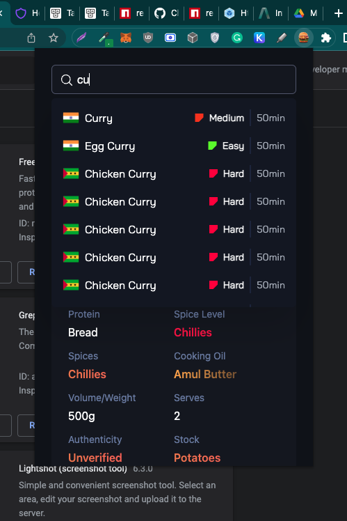

# Yumazzo - Chrome - Extension 🧩

<p align="center">
  
</p>

#### Note related commits & docs: Emojies in commits and docs, make the dry-code world a bit joyfull

KEY: 📦 NEW, 👌 IMPROVE, 🐛 FIX, 📖 DOC, 🚀 RELEASE, ✅ DONE, and 🤖 TEST

<!-- TABLE OF CONTENTS -->
<details open="open">
  <summary><h2 style="display: inline-block">Table of Contents 📖</h2></summary>
  <ol>
    <li>
      <a href="#about-the-project">About The Project</a>
      <ul>
        <li><a href="#context">Context</a></li>
      </ul>
      <ul>
        <li><a href="#features">Features</a></li>
      </ul>
      <ul>
        <li><a href="#built-with">Built With</a></li>
      </ul>
      <ul>
        <li><a href="#screenshots">Screenshots</a></li>
      </ul>
    </li>
    <li>
      <a href="#getting-started">Getting Started</a>
      <ul>
        <li><a href="#prerequisites">Prerequisites</a></li>
        <li><a href="#installation">Installation</a></li>
      </ul>
    </li>
    <li><a href="#weaknesses">Weaknesses</a></li>
    <li><a href="#improvements">Improvements</a></li>
  </ol>
</details>

<!-- ABOUT THE PROJECT -->

## 🚧 About The Project

**Yumazzo-Chrome-Extension** is an extension written in Javascript; Frontend in React.js, Tailwindcss etc. chrome-extension directory is bootstraped with npx create-react-app. You can learn more in the [Create React App documentation](https://facebook.github.io/create-react-app/docs/getting-started).

### Context

The goal of the Yumazoo extension is to create a seamless user experience for accessing and managing recipes.
One of the key features is to implement a search bar that allows users to search for existing recipes based on their names. The search functionality send a request to the appropriate backend endpoint and display the search results dynamically on the front-end interface. The search bar provide real-time suggestions as the user types, enhancing the usability of the application.

In addition to the search functionality, all other API endpoints are integrated into the front-end application. This includes retrieving a list of recipes, retrieving a specific recipe by ID, and adding a new recipe to the server. The front-end handles HTTP requests and responses appropriately, displaying any error messages returned by the backend API in a user-friendly manner.

### Features

- web extension for chrome
- search for recipes
- add new recipes
- view a specific recipe
- responsive design

### Built With

- [React](https://reactjs.org/)
- [Tailwindcss](https://tailwindcss.com/)
- [Webpack](https://webpack.js.org/)
- [Typescript](https://www.typescriptlang.org/)

### Screenshots


<!-- GETTING STARTED -->

## 🚀 Getting Started

To get a local copy up and running follow these steps.

### Prerequisites

You'll need Node and Git installed on your system.

### Installation

1. Clone the repository.

   ```sh
   git clone https://github.com/shoaibshebi/yumazzo.git && cd chrome-extension
   ```

2. Run project on local server.

   ````sh
    npm i
    npm run start
   ```:
   ````

Go to `http://localhost:3000/` to see the Frontend app.

3. Building the extension for chrome browser

```sh
cd chrome-extension
npm i
npm run build
```

4. Go to `chrome://extensions/` in your browser and click “Load unpacked extension.” Navigate to the directory in which your extension files live, and select the `build` directory.

5. Click on the extension icon on the top right corner of the browser and you will see the extension popup.

Woohoo 🙌! you are done now. ✅

‼️ If some thing dos'nt work, please mail the issue with screen shots on this -> shoaib4030891@gmail.com

<!-- weaknesses -->

## 🐛 Code Weaknesses

- Debouncing is not implemented for search bar coz we don't have recipe search API
- Image lazy loading is not implemented due to time constraints which would improve the overall search performace
- Infinite scroll could be implemented for long search results, to load efficiently

<!-- improvements -->

## 🔧 Improvements

- Writing tests for the components to make the code more robust
- Debouncing is not implemented for search bar coz we don't have recipe search API
- Image lazy loading is not implemented due to time constraints which would improve the overall search performace
- Infinite scroll could be implemented for long search results, to load efficiently
